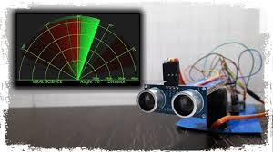
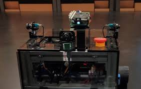

# Week 5 实训任务终稿：FR_mid 车辆硬件集成与 Apollo 3.0 架构深度解析

## 文档概览

**项目名称**：FR_mid 车辆硬件基础与 Apollo 3.0 架构源码 
**提交日期**：Week-5
**内容摘要**：本文档详细记录了 FR_mid 自动驾驶车辆的硬件集成方案、安全机制操作流程，以及 Apollo 3.0 软件架构的深度代码映射。通过对核心传感器物理特性的分析和软件模块源码的定位，旨在建立对自动驾驶软硬件协同工作的全面理解。 

---

## 任务1: FR_mid 车辆核心硬件与紧急制动机制 (Vehicle Hardware & Emergency Braking)

本部分主要涵盖 FR_mid 车辆的安全操作规范及核心传感器组的详细工作原理分析。 

### 1. 车辆紧急制动系统 (Emergency Braking System)

自动驾驶车辆的安全机制是第一优先级的考核内容。FR_mid 车辆配备了物理层面的紧急制动系统（E-Stop），能够在软件失效或紧急状况下强制切断底盘动力。 

#### 1.1 紧急制动按钮位置 (Location)

紧急制动按钮通常采用工业级红色蘑菇头设计，具备自锁功能。在 FR_mid 平台上，其布局通常包含两部分：

1. **车内主控台：** 位于驾驶员或安全员右手边最易触及的位置，用于在测试过程中随时接管。
2. **车身外部（扩展）：** 根据安全规定，车辆外部（通常在车顶传感器架后方或车尾防撞梁附近）也设有急停按钮，供车外观察员在车辆失控时从外部切断动力。

1.2 操作流程详解 (Operation Procedure) 

* **紧急制动触发（Engage）：**
* **场景：** 当车辆出现非预期加速、路径规划严重偏差、即将发生碰撞或软件系统死机时。
* **动作：** 垂直用力**按下**红色急停按钮。
* **物理反馈：** 按钮会发出“咔哒”一声并锁定在下沉位置。此时，底盘线控系统（VCU）会立即断开驱动电机继电器，制动卡钳锁死，车辆在物理惯性结束后完全静止。

* **解除制动与复位（Disengage）：**
* **场景：** 确认周围环境安全，且软件故障已排查完毕，准备重新启动自动驾驶时。
* **动作：** 按照按钮表面的白色箭头指示方向（通常为**顺时针**）旋转按钮。
* **物理反馈：** 按钮会弹起复位。
* **软件复位：** 物理复位后，底盘通常处于“故障保护”状态。需要在 Apollo Dreamview 界面或底盘调试软件中清除故障码（Clear Faults），并重新下发 `Enable` 指令，才能再次接管车辆。

---

2. 核心传感器硬件组成及深度原理解析 

FR_mid 平台集成了多源传感器融合方案，以下是对各核心组件的深度技术解析。

2.1 LiDAR (激光雷达) 

* **核心定义：** LiDAR (Light Detection and Ranging) 是自动驾驶系统的“主视觉”，提供高精度的三维空间几何信息。
* **工作原理 (ToF - Time of Flight)：**
激光雷达通过发射器向外发射高频激光脉冲（通常为 905nm 或 1550nm 波长）。当激光遇到障碍物时发生漫反射，部分能量返回接收器。系统通过计算激光脉冲的往返时间  来计算距离 ：

其中  为光速。
通过内部的旋转棱镜或机械旋转底座，激光束在水平 360° 和垂直方向上进行高速扫描，每秒产生数万至数百万个点，形成**点云 (Point Cloud)**。
* **在车辆中的作用：**
1. **高精度建图：** 结合 SLAM 算法构建环境地图。
2. **障碍物检测与跟踪：** 不受光照影响（白天黑夜均可工作），能精确识别物体的位置、大小和形状。
3. **定位辅助：** 将实时点云与预先建立的高精地图（HD Map）进行匹配（如 NDT 算法），实现厘米级定位。

2.2 GNSS/IMU (组合导航系统) 

单纯的 GPS 无法满足自动驾驶厘米级的定位需求，且易受遮挡。因此采用了 GNSS 与 IMU 紧耦合的组合导航方案。

* **GNSS (全球导航卫星系统)：**
* **原理：** 接收 GPS、北斗等卫星信号。为了提高精度，通常配合 RTK (Real-Time Kinematic) 基站差分技术，消除电离层误差，将定位精度从米级提升至厘米级。
* **局限：** 更新频率低（10Hz 左右），且在隧道、高楼林立处易产生多路径效应或信号丢失。

* **IMU (惯性测量单元)：**
* **原理：** 内部包含三轴陀螺仪（测量角速度）和三轴加速度计（测量加速度）。通过对加速度进行二次积分获得位移，对角速度积分获得姿态（Pitch, Roll, Yaw）。
* **优势与局限：** 更新频率极高（100Hz-200Hz），短时间内精度高，且不需要外部信号；但存在随时间增长的累积误差（Drift）。

* **协同工作机制 (Sensor Fusion)：**
系统利用 **卡尔曼滤波 (Kalman Filter)** 或其变体（如 EKF）进行数据融合。
* **预测步骤：** 利用 IMU 的高频数据推算当前位姿。
* **更新步骤：** 当 GNSS 信号到达时，利用 GNSS 的绝对坐标修正 IMU 的累积误差。
最终输出包含位置、速度、姿态、航向角的高频、高可靠性定位流。

2.3 感知摄像头 (Perception Camera) 

* **工作原理：**
摄像头由镜头组、CMOS 感光元件和 ISP (图像信号处理器) 组成。它通过光电效应将光信号转换为数字 RGB 图像矩阵。
在自动驾驶中，这些图像数据被输入到车载计算单元（IPC），利用**卷积神经网络 (CNN)** 等深度学习模型（如 YOLO, SSD, Faster R-CNN）进行特征提取。
* **作用：**
它是唯一能感知**颜色**和**纹理**的传感器。
1. **交通标志识别：** 识别红绿灯状态、限速牌、停止牌。
2. **车道线检测：** 识别实线、虚线、黄线，辅助车辆保持在车道内。
3. **物体分类：** 虽然激光雷达知道那里有东西，但摄像头能更准确地判断那是“行人”、“骑行者”还是“汽车”。

2.4 超声波雷达 (Ultrasonic Radar) 

* **工作原理：**
利用压电陶瓷探头发出频率超过 20kHz 的超声波（通常为 40kHz 或 58kHz）。声波呈锥形传播，遇到障碍物反射。传感器计算声波发射与接收的时间差。

* **作用：**
* **近距离感知：** 有效探测距离通常在 0.2m 至 5m 之间。
* **盲区监测：** 弥补激光雷达在近身区域的盲区（Blind Spot Detection）。
* **自动泊车：** 是自动泊车系统（APA）的主力传感器，用于探测车位边缘和障碍物。

2.5 毫米波雷达 (Millimeter Wave Radar) 

* **工作原理：**
通常工作在 77GHz 频段，发射调频连续波 (FMCW)。利用**多普勒效应 (Doppler Effect)**，当波束打到移动物体上返回时，频率会发生变化。通过分析频率差，可以同时直接测出目标的**距离**和**相对速度**。
* **作用：**
1. **全天候特性：** 毫米波波长介于光波和无线电波之间，穿透力强，不受雨、雪、雾、霾、沙尘暴影响。
2. **动态目标追踪：** 对运动物体的速度检测极其敏感，是自适应巡航 (ACC) 和自动紧急制动 (AEB) 不可或缺的传感器。

---

## 任务2: Apollo 3.0 软件架构详解与源码映射 (Apollo 3.0 Architecture & Source Mapping)

Apollo 3.0 是一个模块化、高内聚的自动驾驶软件开放平台。理解其架构是进行二次开发的基础。本节将详细梳理各模块的功能定义及其在源码目录中的具体位置。 

1. Apollo 3.0 软件架构与源码映射表 

下表严格对应 Apollo 项目根目录下的 `modules/` 结构，总结了各模块的核心职责。

| 模块名称 (Module Name) | 核心功能深度解析 (Core Function Description) | 源码路径 (Source Code Path) |
| --- | --- | --- |
| **Perception (感知)** | **“眼睛”**：负责处理 Lidar 点云和 Camera 图像。包含四大子任务：障碍物检测 (Detection)、障碍物追踪 (Tracking)、场景语义分割 (Segmentation) 和传感器融合 (Fusion)。输出带类别、位置、速度的障碍物列表。 | `modules/perception` |
| **Localization (定位)** | **“位置感”**：基于 MSF (Multi-Sensor Fusion) 框架，融合 GPS、IMU 和 Lidar 数据。通过直方图滤波或卡尔曼滤波，输出车辆在全局地图中的高精度位姿（x, y, z, roll, pitch, yaw）。 | `modules/localization` |
| **Map (地图)** | **“记忆”**：解析高精度地图（OpenDRIVE 格式变体）。提供 API 供其他模块查询路网拓扑、车道中心线、限速信息、红绿灯位置等静态环境数据。 | `modules/map` |
| **Prediction (预测)** | **“预判”**：接收感知模块输出的障碍物信息和定位信息。利用 RNN 或卡尔曼滤波算法，预测障碍物在未来 3-5 秒内的运动轨迹和意图（如切入、直行），为规划层提供约束。 | `modules/prediction` |
| **Routing (路由)** | **“导航”**：宏观路径规划。根据起点和终点，在拓扑地图上利用 A* 或 Dijkstra 算法搜索出一条全局最优的道路级别的路径（例如：沿 A 路行驶 500米 -> 右转进入 B 路）。 | `modules/routing` |
| **Planning (规划)** | **“大脑”**：微观轨迹规划。在 Routing 提供的全局路径引导下，结合 Prediction 的动态障碍物信息，生成一条平滑的、无碰撞的、符合车辆运动学的局部轨迹（包含每一帧的时间 t、位置 s、速度 v）。Apollo 3.0 主要使用 EM Planner（基于期望最大化）或 Lattice Planner。 | `modules/planning` |
| **Control (控制)** | **“手脚”**：轨迹跟踪。接收 Planning 生成的轨迹，通过控制算法（纵向 PID/级联 PID，横向 LQR/MPC 模型预测控制）计算出底盘需要的油门百分比、刹车深度和方向盘转角，力求让车辆实际行驶轨迹贴合规划轨迹。 | `modules/control` |
| **Canbus (总线)** | **“神经”**：硬件抽象层。负责解析底盘 CAN 协议（如 Lincoln MKZ 协议），将 Control 层的抽象指令转换为具体的 CAN 报文发送给车辆，同时解析车辆反馈的底盘状态（车速、轮速、档位）供上层使用。 | `modules/canbus` |
| **Guardian (守护)** | **“安全员”**：独立的安全监控模块。当检测到 Monitor 发出的严重故障信号（如心跳丢失）或 HMI 的急停指令时，强制介入，切断控制信号并触发紧急停车逻辑。 | `modules/guardian` |
| **Monitor (监控)** | **“体检医生”**：全系统健康监控。实时检查各硬件节点（传感器、CAN卡）的连接状态，以及各软件模块的进程存活状态、消息发布频率（延时）。一旦发现异常，立即发布系统报警。 | `modules/monitor` |
| **Dreamview (HMI)** | **“交互界面”**：基于 Web 的可视化人机交互界面。用于启动/关闭各模块、切换自动驾驶模式、可视化显示 3D 场景（点云、地图、规划轨迹）以及记录数据（Rosbag）。 | `modules/dreamview` |
| **Tools (工具)** | 提供各类辅助开发工具，如标定工具 (Calibration)、录制回放工具、诊断工具等。 | `modules/tools` |
| **Common (公共)** | 存放各模块共用的基础库、配置文件、数学库 (Math)、日志库和消息协议定义 (Proto)。 | `modules/common` |

### 2. 模块间数据流向简述 (Data Flow Overview)

为了更好地理解上述模块如何协同，以下是 Apollo 3.0 一个典型的处理周期（100ms）：

1. **输入：** 传感器（Lidar, Camera, GPS/IMU）采集原始数据。
2. **感知与定位：** `Perception` 模块识别出周围有障碍物；`Localization` 模块确认车辆自己在地图的 (100, 200) 坐标点。
3. **决策链：**
* `Map` 模块告知当前车道限速 40km/h。
* `Routing` 模块指出我们要直行。
* `Prediction` 模块预测右前方行人在 2秒后会横穿马路。
* `Planning` 模块综合上述信息，生成一条“先减速避让行人，再加速直行”的轨迹曲线。

4. **执行：** `Control` 模块根据轨迹计算出“方向盘回正，刹车踩下 20%”的指令，通过 `Canbus` 发送给汽车。
5. **反馈：** 汽车执行动作，新的物理状态再次被传感器捕获，进入下一个循环。

---

## 结论 (Conclusion)

通过本周的实训任务，我们深入了解了 FR_mid 自动驾驶开发平台的硬件基础，掌握了紧急制动系统的物理操作与逻辑复位方法，这是实车调试的安全基石。同时，通过对 Apollo 3.0 源码目录的梳理，我们建立了从“硬件传感器输入”到“软件算法处理”再到“车辆执行输出”的完整闭环认知。

---
